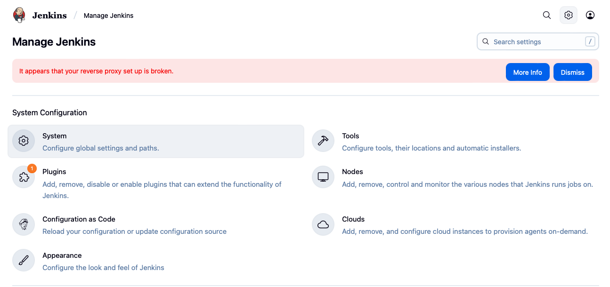
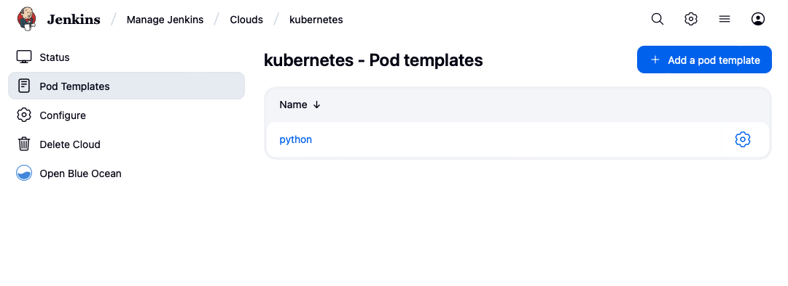

- [Set up Jenkins using helm](#set-up-jenkins-using-helm)
  - [Prepare](#prepare)
  - [Deploy Jenkins master instance](#deploy-jenkins-master-instance)
  - [Expose Jenkins to a public IP Address on the Cloud](#expose-jenkins-to-a-public-ip-address-on-the-cloud)
  - [Expose Jenkins as svc on your local minikube](#expose-jenkins-as-svc-on-your-local-minikube)
    - [Proxy broken](#proxy-broken)
  - [Pre-install additional plugins](#pre-install-additional-plugins)
  - [Configure as Code](#configure-as-code)
  - [Back up data volumes](#back-up-data-volumes)
    - [Option 1 - save it to another directory](#option-1---save-it-to-another-directory)
    - [Option 2 - save it in persistence volumes](#option-2---save-it-in-persistence-volumes)
  - [Add agents](#add-agents)
  - [Use agent](#use-agent)

# Set up Jenkins using helm
This is a quick guide for setting up Jenkins on your laptop using `minikube`, `Docker` and `Helm`, which helps you ship it to production on AWS(EKS), GCP(GKE) or Azure(AKS).

Reference -> 
[How to install a Jenkins instance with Helm](https://octopus.com/blog/jenkins-helm-install-guide)

## Prepare
1. knowledge base on k8s, [EKS](https://aws.amazon.com/eks/), 
   [GKE](https://cloud.google.com/kubernetes-engine),
   and [AKS](https://azure.microsoft.com/en-au/services/kubernetes-service/)
2. Install `Docker Desktop`
3. Install `minikube`
4. install `helm`

## Deploy Jenkins master instance
Enter the workspace.
```zsh
cd setup-jenkins-with-helm
```
1. Jenkins Helm charts are provided from https://charts.jenkins.io. To make this chart repository available, run the following commands:
```zsh
helm repo add jenkins https://charts.jenkins.io
helm repo update
# check the repo
helm search repo jenkins
```
2. Deploy the master instance
```zsh
# create a namespace
kubectl create namespace devops
# list all namespaces
kubectl get namespace
# deploy the master instance
helm upgrade --install annz-jenkins jenkins/jenkins --values master/values.yaml
```
When it returns something like:
```text
Release "annz-jenkins" does not exist. Installing it now.
NAME: annz-jenkins
LAST DEPLOYED: Mon Aug 11 16:38:34 2025
NAMESPACE: default
STATUS: deployed
REVISION: 1
NOTES:
1. Get your 'admin' user password by running:
  kubectl exec --namespace devops -it svc/annz-jenkins -c jenkins -- /bin/cat /run/secrets/additional/chart-admin-password && echo
2. Get the Jenkins URL to visit by running these commands in the same shell:
  echo http://127.0.0.1:8080
  kubectl --namespace devops port-forward svc/annz-jenkins 8080:8080

3. Login with the password from step 1 and the username: admin
4. Configure security realm and authorization strategy
5. Use Jenkins Configuration as Code by specifying configScripts in your values.yaml file, see documentation: http://127.0.0.1:8080/configuration-as-code and examples: https://github.com/jenkinsci/configuration-as-code-plugin/tree/master/demos

For more information on running Jenkins on Kubernetes, visit:
https://cloud.google.com/solutions/jenkins-on-container-engine

For more information about Jenkins Configuration as Code, visit:
https://jenkins.io/projects/jcasc/
```
Save the password and use it to login Jenkins admin page. Once you have loggedin you can change the admin password.

You can export the service to a different `port` for local access, for example:
```zsh
echo http://127.0.0.1:4444
kubectl --namespace devops port-forward svc/annz-jenkins 4444:8080
```
## Expose Jenkins to a public IP Address on the Cloud
If you want to run Jenkins in EKS cluster and maintain the infrastructure fully bu yourself, you might need to run code in `terraform` first.
1. boostrap S3 bucket and DynamoDB
```zsh
cd terraform/bootstrap
terraform plan
terraform apply
```
2. create Vpc
```zsh
cd terraform/vpc
terraform plan
terraform apply
``` 
3. create everything for Jenkins

Update sg and subnets in some files then run: 
```zsh
cd terraform/jenkins
terraform plan
terraform apply
```
1. Update values

To access Jenkins through a publicly available IP address, you must override the default configuration defined in the chart via `master/values-public.yaml`.
```zsh
# create storage class
kubectl apply -f master/sc.yaml

# install Jenkins
helm upgrade --install -f master/values-public.yaml annz-jenkins jenkins/jenkins
```
It returns something like:
```text
Release "annz-jenkins" has been upgraded. Happy Helming!
NAME: annz-jenkins
......
NOTES:
1. Get your 'admin' user password by running:
  kubectl exec --namespace devops -it svc/annz-jenkins -c jenkins -- /bin/cat /run/secrets/additional/chart-admin-password && echo
1. Get the Jenkins URL to visit by running these commands in the same shell:
  NOTE: It may take a few minutes for the LoadBalancer IP to be available.
        You can watch the status of by running 'kubectl get svc --namespace devops -w annz-jenkins'
  export SERVICE_IP=$(kubectl get svc --namespace devops annz-jenkins --template "{{ range (index .status.loadBalancer.ingress 0) }}{{ . }}{{ end }}")
  echo http://$SERVICE_IP:8080/login

1. Login with the password from step 1 and the username: admin
2. Configure security realm and authorization strategy
3. Use Jenkins Configuration as Code by specifying configScripts in your values.yaml file, see documentation: http:///configuration-as-code and examples: https://github.com/jenkinsci/configuration-as-code-plugin/tree/master/demos

For more information on running Jenkins on Kubernetes, visit:
https://cloud.google.com/solutions/jenkins-on-container-engine

For more information about Jenkins Configuration as Code, visit:
https://jenkins.io/projects/jcasc/


NOTE: Consider using a custom image with pre-installed plugins
```
To access Jenkins, open http://service_ip_or_hostname:8080
## Expose Jenkins as svc on your local minikube
```zsh
helm upgrade --install -f master/values-minikube.yaml annz-jenkins jenkins/jenkins
```
It returns:
```text
Release "annz-jenkins" has been upgraded. Happy Helming!
NAME: annz-jenkins
LAST DEPLOYED: Mon Aug 11 17:22:23 2025
NAMESPACE: default
STATUS: deployed
REVISION: 2
NOTES:
1. Get your 'admin' user password by running:
  kubectl exec --namespace devops -it svc/annz-jenkins -c jenkins -- /bin/cat /run/secrets/additional/chart-admin-password && echo
2. Get the Jenkins URL to visit by running these commands in the same shell:
  export NODE_PORT=$(kubectl get --namespace devops -o jsonpath="{.spec.ports[0].nodePort}" services annz-jenkins)
  export NODE_IP=$(kubectl get nodes --namespace devops -o jsonpath="{.items[0].status.addresses[0].address}")
  echo http://$NODE_IP:$NODE_PORT

3. Login with the password from step 1 and the username: admin
4. Configure security realm and authorization strategy
5. Use Jenkins Configuration as Code by specifying configScripts in your values.yaml file, see documentation: http://$NODE_IP:$NODE_PORT/configuration-as-code and examples: https://github.com/jenkinsci/configuration-as-code-plugin/tree/master/demos

For more information on running Jenkins on Kubernetes, visit:
https://cloud.google.com/solutions/jenkins-on-container-engine

For more information about Jenkins Configuration as Code, visit:
https://jenkins.io/projects/jcasc/


NOTE: Consider using a custom image with pre-installed plugins
```
Run command of step1 to get and save initial password.
Run command of step2 to export the service for local access.
Finally, run this command to access it from your localhost.
```zsh
# annz-jenkins is the service name also release-name that you can get 
# by running: kubectl get svc --namespace devops

minikube service annz-jenkins --namespace devops --url
```
### Proxy broken
You may notice that Jenkins reports the following error when you access it.
If the Jenkins is running in localhost, ignore it. Otherwise, it can be resolved by defining the URL in the `controller.jenkinsUrl` property of `master/values-public.yaml` file with the IP address or hostname of your Jenkins instance.


## Pre-install additional plugins
To make sure that each time the deployment comes with the same plugins pre-installed, you may add a list of plugins in the values.file, for example:
```zsh
controller:
    additionalPlugins:
    - blueocean:1.27.21
```
**Note:** This approach is convenient, but the downside is the Jenkins instance is required to 
contact the Jenkins update site to retrieve them as part of the first boot. A more robust approach 
is to download the plugins as part of a custom image, which ensures the plugins are baked into the 
Docker image. It also allows additional tools to be installed on the Jenkins controller.
More details -> [Customize jenkins docker image](https://octopus.com/blog/jenkins-helm-install-guide#installing-additional-plugins)

## Configure as Code
This part is optional.

## Back up data volumes
The data used by Jenkins master is read and written by a single pod as `ReadWriteOnce` volumes, it is critical to back up the data and save it elsewhere periodically or after any change made to the Jenkins system.
### Option 1 - save it to another directory
1. The first command executes tar inside the pod to backup the `/var/jenkins_home` directory to the `/tmp/backup.tar.gz` archive. Note that the pod name `annz-jenkins` is derived from the Helm release name `annz-jenkins`.
```zsh
kubectl exec -c jenkins annz-jenkins -- tar czf /tmp/backup.tar.gz /var/jenkins_home
```
1. copy the backup archive from the pod to your local machine. At this point `backup.tar.gz` can be copied to a more permanent location.
```zsh
kubectl cp -c jenkins annz-jenkins:/tmp/backup.tar.gz ./backup.tar.gz
```
### Option 2 - save it in persistence volumes
When Jenkins is running on the cloud, you can use `sc.yaml` to create `gp3` volumes for persistent data mount, and set the `persistence` config in `values-public.yaml` `true`.
```zsh
# create pvc
kubectl apply -f master/sc.yaml
# Update jenkins
helm upgrade -f master/values-public.yaml annz-jenkins jenkins/jenkins
```
## Add agents
Jenkins agents are used to execute a series tasks isoloated from others. When you install it by the chart without specifying `agent`, it starts two pods, one as the master and the other as the agent. You can also dynamically create Jenkins agents in the cluster by specifying `agent` content in `values-minikube.yaml` file. These agents are created when new tasks are scheduled in Jenkins and are automatically cleaned up after the tasks are completed.

**Note:** when you choose to create agents dynamically and re-launch Jenkins, you will see only one pod `annz-jenkins-0` running as master when no task is scheduled or running.

The default settings for agents are defined under the agent property in the `values-minikube.yaml`file. The example below defines an customized agent with the Jenkins label `python`, created in pods prefixed with the name default, and with CPU and memory limits.
```zsh
agent:
  podName: default
  customJenkinsLabels: default
  envVars:
  - name: HOME
    value: /home/jenkins/agent
  - name: PATH
    value: /usr/local/bin
  resources:
    limits:
      cpu: "1"
      memory: "2048Mi"
  additionalAgents:
    python:
      podName: python
      customJenkinsLabels: python
      sideContainerName: python
      image:
        repository: python
        tag: "3"
      command: "/bin/sh -c"
      args: "cat"
      TTYEnabled: true
  disableDefaultAgent: true
  podTemplates:
    python: |
      - name: python
        label: jenkins-python
        serviceAccount: jenkins
        containers:
          - name: python
            image: python:3
            command: "/bin/sh -c"
            args: "cat"
            ttyEnabled: true
            privileged: true
            resourceRequestCpu: "400m"
            resourceRequestMemory: "512Mi"
            resourceLimitCpu: "1"
            resourceLimitMemory: "1024Mi"
  volumes:
    - type: EmptyDir
      mountPath: /var/myapp/myemptydir
      memory: false
```
Go to `Manage Jenkins` -> `Clouds` -> `kubernetes` -> `Pod Templates`, edit the Pod Template.



## Use agent
Define `jenkins.pipeline` for agents to execute tasks in the pipeline. The agent block should be like:
```zsh
pipeline {
  agent {
      kubernetes {
          inheritFrom 'python'
      }
  }
  stages {
   stage('Prepare') {
    steps {
      echo "Fetch data"
    }
   }
  }
}
```